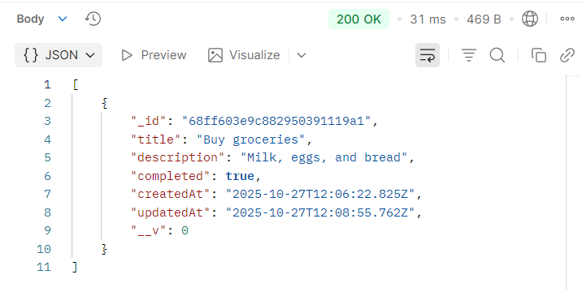
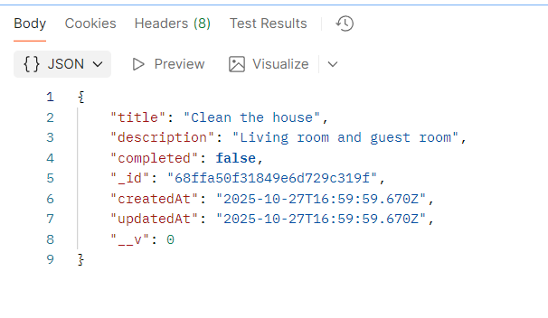
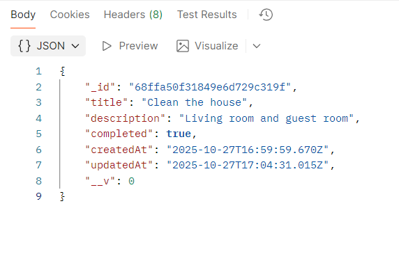
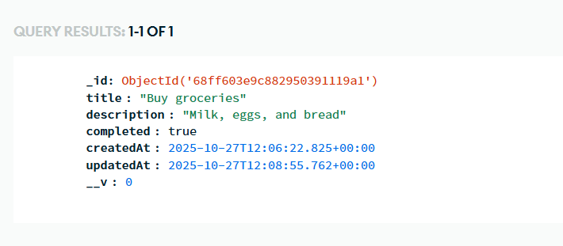
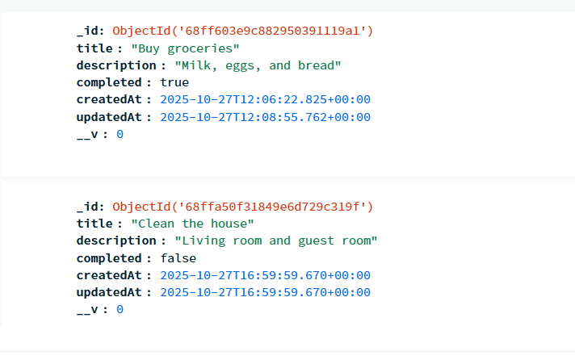
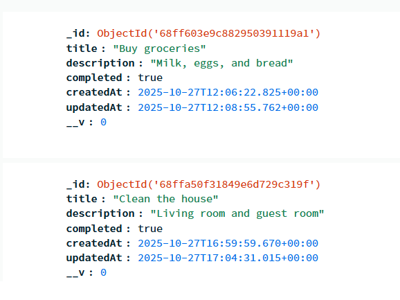

# Task Manager API

A simple and well-structured **Node.js + Express backend** application that allows users to **create, read, update, and delete (CRUD)** tasks.  
It connects to **MongoDB Atlas** using Mongoose and is tested using **Postman**.  

This project was built as part of my learning journey to become a **backend developer** and demonstrates core RESTful API concepts, validation, and database interaction.

---

## Features

✅ Create new tasks  
✅ View all tasks  
✅ Update existing tasks  
✅ Delete tasks  
✅ Input validation using Mongoose  
✅ MongoDB Atlas connection  
✅ Error handling and clean folder structure  

---

## Tech Stack

| Category | Technology |
|-----------|-------------|
| Backend Framework | **Express.js** |
| Runtime Environment | **Node.js** |
| Database | **MongoDB Atlas (Mongoose ODM)** |
| Testing Tool | **Postman** |
| Language | **JavaScript (ES6)** |

---

## Project Structure

task-manager-api/
│
├── controllers/ # Handles request logic
│ └── taskControllers.js
│
├── models/ # Database models (schemas)
│ └── taskModel.js
│
├── routes/ # API routes
│ └── taskRoutes.js
│
├── config/ # Database connection setup
│ └── db.js
│
├── .env # Environment variables (not uploaded to GitHub)
├── .gitignore # Files/folders to ignore
├── package.json # Project dependencies and scripts
├── server.js # Entry point of the app
└── README.md # Project documentation

---

## Key Learning Points

- Setting up an Express server with modular routes
- Connecting Node.js backend to MongoDB Atlas
- Building RESTful APIs with CRUD functionality
- Using Postman for API testing
- Writing clean, maintainable backend code
- Proper Git and GitHub workflow

## Screenshots of Postman

### Postman - Get All Tasks

### Postman - Create Task

### Postman - Update Task

## Screenshots of MongoDB

### MongoDB - All Tasks

### MongoDB - New Task

### MongoDB - Update Task
